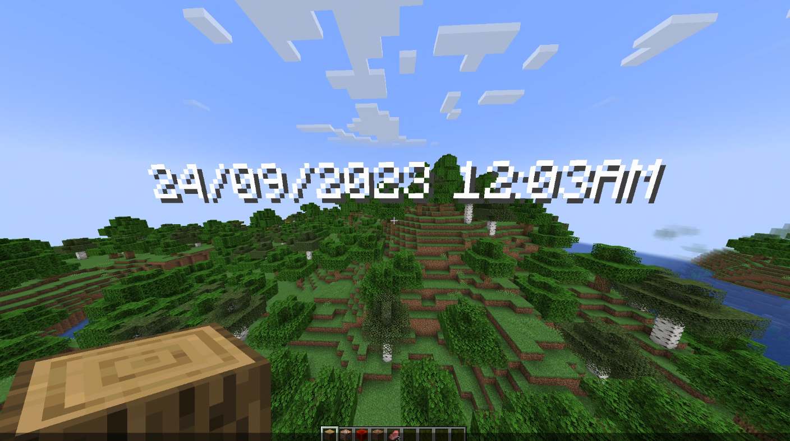

# TextDisplay

A plugin that makes text display, supporting [PlaceholderAPI](https://github.com/PlaceholderAPI/PlaceholderAPI)!



## Usage

```
/textdisplay help - Shows help message
/textdisplay create <name> <x> <y> <z> <text> - Create a text display
/textdisplay set <name> <property> <value> - Edit a text display(text, scale, shadow, background, etc...)
/textdisplay delete <name> - Delete a text display
/textdisplay reload - Reload texts from config file
```

### Details about `/textdisplay set`

| Property          | Description                                                       |
|-------------------|-------------------------------------------------------------------|
| text              | you can change the text here                                      |
| position          | position of the text                                              |
| rotation          | rotation of the text                                              |
| updateInterval    | the interval the text should be updated(set to 0 to disable this) |
| scale             | scale(refer to minecraft display transformation)                  |
| translation       | translation(refer to minecraft display transformation)            |
| leftRotation      | left rotation(refer to minecraft display transformation)          |
| rightRotation     | right rotation(refer to minecraft display transformation)         |
| billboard         | the `billboard` option in text display                            |
| alignment         | the alignment of the text                                         |
| defaultBackground | whether or not to show text background                            |
| seeThrough        | sets if the text should be seen through a block                   |
| shadow            | whether or not to show text shadow                                |
| lineWidth         | width per line                                                    |

## Permissions

All commands have permission starting with `textdisplay.command`

| Command             | Permission          |
|---------------------|---------------------|
| /textdisplay        | textdisplay.command |
| /textdisplay help   | textdisplay.help    |
| /textdisplay create | textdisplay.create  |
| /textdisplay set    | textdisplay.set     |
| /textdisplay delete | textdisplay.delete  |
| /textdisplay reload | textdisplay.reload  |
